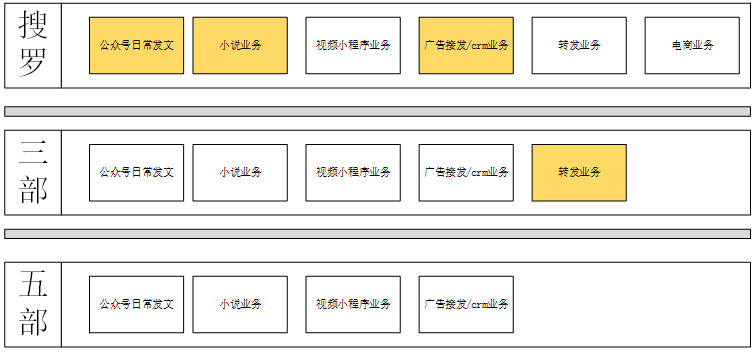
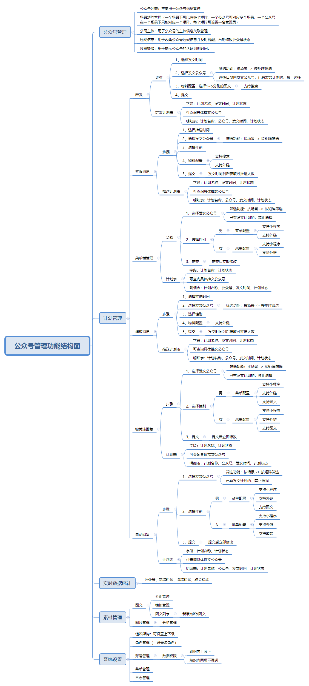
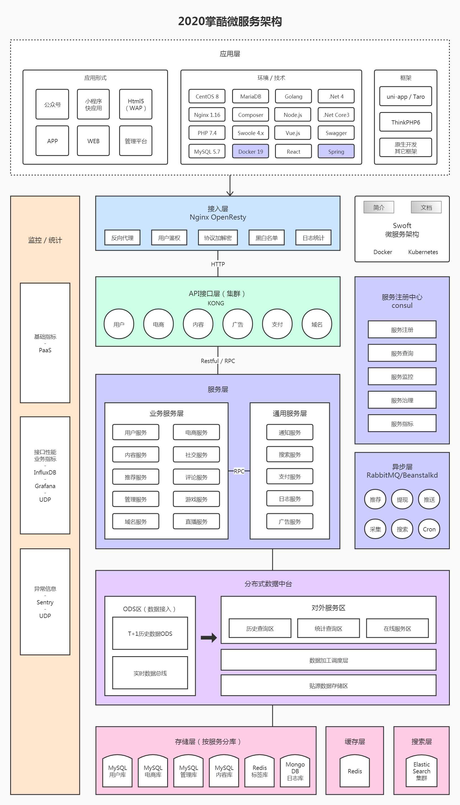

# 掌酷iMSE组建历程
> 总体规划、大事纪要
# 1. 前期工作
## 1.0 组建计划会
2020.1.15 《2020掌酷微服务架构组建计划》[会议资料](iMSE-plan2020.md)

## 1.1 架构团队组建
+ 成立：内招高级程序员
+ 培养：了解，学习，提高
+ 制度
1. 项目管理 + 知识分享
2. 团队建设，技术分享，工程师文化

## 1.2 总体规划
### 1 团队规划
1. 第一阶段 3人：架构师1人 + 运维1人 + 后端1人
2. 第二阶段 3人：架构师1人 + 运维1人 + 后端1人
3. 第三阶段 5人：架构师1人 + 运维1人 + 产品1人 + 前端1人 + 后端1人
4. 第四阶段 8-10人：架构师1人 + 运维1-2人 + 产品1-2人 + 前端≥2人 + 后端≥3人
5. 第五阶段 10-15人：架构师1人 + 运维2-3人 + 产品2-3人 + 前端≥3人 + 后端≥3人 + 数据分析2人

### 2 系统概述
1. 针对掌酷的业务模式而设计的分布式、跨平台的微服务架构，提供应用全生命周期管理、数据化运营、立体化监控和服务治理等功能。
2. 提供掌酷技术开发团队使用的，可扩展、高可用、可持续交付的技术标准化流程

### 3 公司业务模型

### 4 信息系统模型

### 5 应用架构
1. 公众号管理服务

### 6 数据设计

### 7 物理架构

### 8 接口架构

### 9 领域模型

### 10 架构规划

### 11 架构实施
#### 11.1 整体思路

#### 11.2 蓝图Roadmap
[Roadmap](https://shimo.im/sheets/T3wh9QDVxrKjHV8R/MODOC/)

#### 11.3 组建一期

#### 11.4 组建二期

#### 11.5 组建三期

## 1.3 中间件构建
> 流程：调查 → 试用 → 选型 → 深入研究 → Demo → Wiki → 分享推广 → 业务系统试用 → 改进完善 → 大规模推广
>
> 例：Job/Redis/CenterLog/业务监控(Metrics)/Dashboard/调试工具(WinDbg)/RabbitMQ/ORM工具(Dapper)/
> MongoDB/JEtermClient/公共类库(JFx)/ZooKeeper/OpenTSDB/HBse/Search工具(Solr)/元数据管理(DDM)/
> DLL管理(NuGet)/自动发布(Jenkins)/微服务架构(JSOA)

# 2. 组建实施
## 2.1 数据库改造

## 2.2 服务化

## 2.3 应用架构

## 2.4 组织架构调整

# 3. 总结
